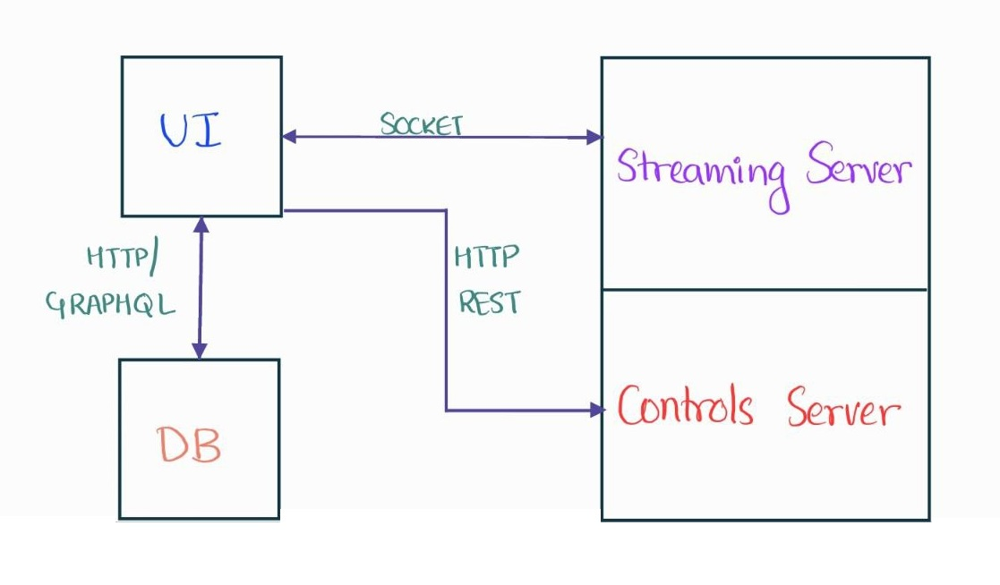

# Game Stream

## Architecture

## Setup
### Screen Streaming Server
The streaming server is written in C++ for high performance and heavily relies on Windows APIs to capture the desktop. This uses the concept of dirty pixels to significantly reduce the pixels sent over the sockets.

1. Download [Visual Studio 2022 Community Edition](https://visualstudio.microsoft.com/downloads/).
2. Clone the repo: **git clone https://github.com/varunv997/it5007_project.git** 
3. Open it5007_project/BE-ScreenCaptureServer/proj/vs2017/ScreenCaptureServer.sln on Visual Studio.
4. Run the program on debug mode (F5).

**Note:** If you dont want to modify the code and just run the application, the exe file is provided (it5007_project/BE-ScreenCaptureServer/executable/ScreenCaptureServer.exe). Just double click and run the server.

### Controls Server
The controls server is written in Python as a REST webservice where it captures GET requests and facilitates launching a game forwarding controls to the application.

1. Install [Python 3.10](https://www.python.org/downloads/).
2. pip install keyboard flask flask_cors
3. cd BE-ControlsServer
4. **Change the IP address in controls_server to the local ip address of the machine**
5. python controls_server.py

### DB Server
The DB server stores the user information after she logs into the application via google login. Preferably, this should run in a linux machine (not necessary).

1. **Install mongodb** 
    a. wget -qO - https://www.mongodb.org/static/pgp/server-5.0.asc | sudo apt-key add – 
    b. echo "deb [ arch=amd64,arm64 ] https://repo.mongodb.org/apt/ubuntu focal/mongodb-org/5.0 multiverse" | sudo tee /etc/apt/sources.list.d/mongodb-org-5.0.list 
    c. sudo apt-get update && sudo apt-get upgrade 
    d. sudo apt-get install -y mongodb-org 
2. **Start mongodb** 
    a. sudo screen mongod
3. **Install node** 
    a. wget -qO- https://raw.githubusercontent.com/nvm-sh/nvm/v0.39.1/install.sh | bash 
    b. nvm install 14.1.0 
    c. export NVM_DIR="$HOME/.nvm" 
    d. [ -s "$NVM_DIR/nvm.sh" ] && \\. "\$NVM/nvm.sh" 
    e. [ -s "$NVM_DIR/bash_completion" ] && \\. "\$NVM_DIR/bash_completion" 
    f. nvm use 14.1.0 
4. **Run** 
    a. cd api 
    b. npm install 
    c. npm run 

**Note:** You should now be able to navigate to localhost:3000/graphql

### Front End
The Front End provides the UI for the client to access the Game Streaming Server.
1. cd fe
2. npm install
3. **Change the IP addresses in fe/src/components/pages/Services.js to the local ip address of the machine.**
4. npm start

**Note:** You should now be able to navigate to localhost:8000 (The home page of the web application).

### Contact Information
For queries related to setup and to report bugs, please contact varun_vn@u.nus.edu.